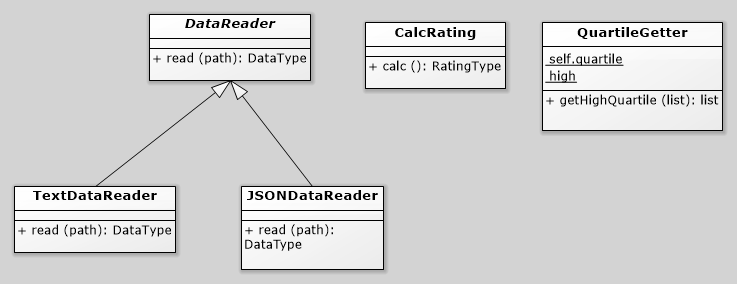

# Лабораторная 1 по дисциплине "Технологии программирования"
Знакомство с системой контроля версий Git и инструментом CI/CD GitHub Actions
В лабораторной работе используется проект, рассчитывающий средний
рейтинг студентов по дисциплинам. Список студентов и полученных ими оценок приводится в
текстовом файле. Проект написан на языке программирования Python 3, модульное тестирование в нем
осуществляется с помощью библиотеки pytest. Проект оформлен в виде директории rating.
Индивидуальное задание:
Формат входного файла: JSON
Расчетная процедура: Определить и вывести на экран всех студентов, чей
рейтинг попадает в последнюю квартиль распределения
по рейтингам.
Ход работы:
В проект был добавлен класс-наследник DataReader - JSONDataReader, реализующий метод read для JSON-файлов. Метод считывет данные о студетах и сохраняет их в поле students, являющееся списком.
Помимо этого был реализован класс QuartileGetter, отвечающий за определение студентов, попадающих в верхний квартиль распределения. Реализуется это методом getHighQuartile, принимающим список студентов и возвращающий список, состоящий из студентов, входящих в верхний квартиль распределения.
Для новых классов также были добавлены классы тестов.
Диаграмма классов:
